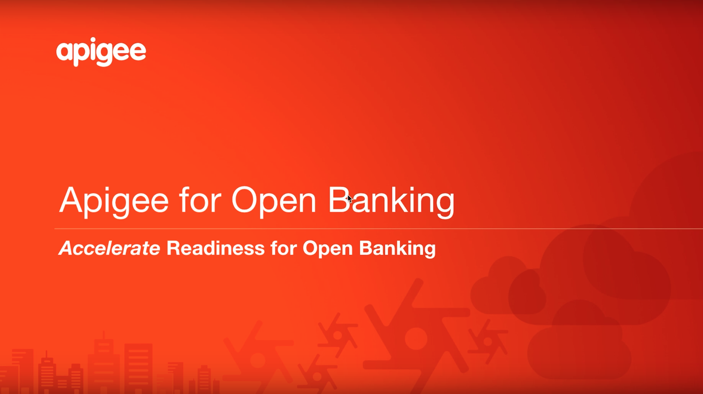
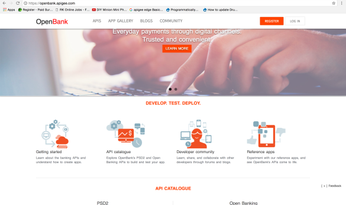

# [](http://apigee.com) Openbank

The Apigee Open Banking APIx solution simplifies and accelerates the process of delivering open banking by providing secure, ready-to-use APIs along with the computing infrastructure to support internal and external innovation.

## Update!
We have created a new video to demonstrate the OpenBank Solution and Installation Steps. Please check out the video below and give us your feedback on what you liked and what you would like to see.

[](http://www.youtube.com/watch?v=8eecvL75B5w "OpenBank APIs and Installation")

This repository is organized into the following sections

[Design](#design)
- [Architecture](#architecture)
- [Security](#security)
- [APIs](#functional-apis)  

[Setup](#setup)
- [Getting Started](#getting-started)
- [Installation](#installation)
- [Developer Portal](#developer-portal)

[Changelog](#changelog)

## Overview

The OpenBank solution is built on Apigee Edge API Management Platform, and features the following APIs:

**Account Access APIs**
  - Account Information 
  - Account Transaction 
  - Account Information 

**Payment Transfer APIs**
- Payment Initiation

**Open Data APIs**
  - ATM location 
  - Branch Location
  - Bank Products

**Security APIs**
  - OAuth
  - UserInfo


It also provides an implementation of **OpenID** and **oAuth** based authentication, **consent** and **two-factor authentication** using SMS.

### Repository Overview

This repository contains the necessary artifacts that will allow one to pull up
a complete set of **Banking APIs** that comply with _Openbanking_ and _PSD2_
regulations. In addition this will also allow one to build a _sandbox_ complete
with a **Developer Portal**, dummy backend and a sample app.

## Design

The APIs provided are configurable to connect to one's own Core Banking systems and 
for the use of ones own applications to manage end user consent. The following sections will help you
understand this solution so that you can go about this on your own.


### Architecture


The Banking APIs are designed such that each API is chained together as Northbound <-> Southbound APIs.

As shown in the architecture diagram above, the message flow is as follows: 
End user Application <-> _Northbound APIs_ <-> _Southbound APIs_ <-> Backend Systems (Core Banking / Payment etc)


The Northbound API provides a fixed set of interfaces that can be used by
the external consumers. In order to minimize changes to the contract, and there by to applications that connect to it, this API may not be required to change as often.

The Southbound API connects to the actual backend of the bank. We have used a dummy
backend as a default as part of this solution build out. Therefore you may want to modify the southbound interfaces to suite your specific backend needs. 

All **Southbound APIs** end with the suffix _'-connector'_

In addition, there are some internal APIs which are not exposed outside, but
which are used internally from the other APIs and provide common services such as
sending out SMS, storing and fetching session data etc.


Each API deployed in Apigee Edge is encapsulated withing a unit of deployment called a [Proxy](http://docs.apigee.com/api-services/content/understanding-apis-and-api-proxies).
To Learn more on the basic concepts of how to manage these within Apigee Edge, please refer to : 
http://docs.apigee.com/api-services/content/what-apigee-edge

Each of the following entities in the sequence diagram below, such as oAuth, consent-app , session,authentication-connector are examples of proxies.  

There are two broad sets of proxy defenitions in the solution. One set, **Security**,  helps manage the security around the APIs while the other is the set of **Functional APIs** that a bank would like to expose. For example: accounts, payments, branch locations etc.


### Security 
In this solution, access to all APIs are protected via a security mechanism, that requires explicit end user authentication and authorization to make a successful API call. We have broadly used the OAuth 2.0 framework to secure these APIs, with integrated consent management application to manage end user authorization. Therefore, one has to obtain a valid **Access Token** or a one time Token via the Security APIs before making an call to the Functional APIs.
In order to enable **two-factor authentication** for the functional APIs, OTP(one time password) mechanism via SMS has been enabled for each of the APIs, which can be disabled on demand. The sequence diagram below gives an overview on the call flow between various security related proxies to fetch a valid Access Token with two-factor authentication enabled.
#### OAuth API Flow


#### Consent App

The consent app plays a key role in helping the user securely authenticate with the bank. The consent app is a trusted app of the bank which will allow the user to login and subsequently provide consent information.

The consent app will talk to the following APIs in order to
fulfill its functionality : Session API, SMS API, Accounts-connector API, Authentication-connector API.
For more details on each of these APIs, refer to the README.md of the respective proxy which exposes these APIs.

### Functional APIs

The Functional APIs deployed and available as part of OpenBank solution are broadly classified as follow:

####**1. Accounts Information APIS** 
Account information APIs provide information for a single account held by the consumer. Information is categorized into:

 - Information
 - Balance
 - Transactions  

An API end point is provided for each type of information.
These Account Information APIs are secured with **oAuth 2.0** and need a **valid Access token** for making API calls. 
Banking APIs provide developers with the information needed to create innovative fintech apps for consumers.There are a few obvious use cases worth mentioning:

 - Aggregation of financial metrics such as net worth and savings across multiple accounts.
 - Analysis and recommendations for better money management.
 - Reccomendation of products and deals based on monthly statements.

####**2. Payments APIs** 
Payment APIs enable the transfer of funds from a consumer's account to a recipient. The initation of transfer is done by the consumer and the recipient's account number is provided by the third-party payment provider (TPPs or PISPs). While initiating a transfer the user will have to authenticate using **two-factor authentication**(otp via sms) following which the transfer will be initiated.
While online account payment is a fundamental use case of this API, it is its usage and the benefit it provides over traditional third-party payment gateways that makes it hugely impactful. Take a look at some of the use cases:

 - Immediate payment transfers for online purchases, thus providing guaranteed services.
 - Push payments providing merchant with immediate access to the transferred amount.
 - Fast retail loans from third-party lenders

####**3. Open Data APIs** 
Open Data APIs are a category of APIs that provide general information of a Bank. These are not customer-specific, but bank-specific: locations, products, URLs, and events, for example. These APIs are not subjected to user-level authentication, but are are protected to be used only by signed apps. A **valid client credential** is essential to invoke these APIs.
Using this category of APIs, a wide variety of new value-added solutions can be provided to consumers. Coupled with customer-specific information, potential new solutions include product and offer recommendations.

## Apigee Edge Setup

### Getting Started

+   Create an [Apigee API Management Developer Account](https://enterprise.apigee.com)
+   Create an [Apigee BaaS Account](https://apibaas.apigee.com)
+   Request For [Apigee Developer Portal](https://goo.gl/j8Vbew)

To Learn more on the basic concepts of Apigee Edge, please refer to : 
http://docs.apigee.com/api-services/content/what-apigee-edge


To deploy the APIs and its dependencies on your own org please run the following
script from the root folder of the cloned repo.

### Installation 

#### Pre-requisites
+ node.js 
+ npm

#### Instructions

Install gulp 
```
npm install --global gulp-cli
```

Pull node modules
```
npm install
```

Run the deploy command
```
gulp deploy --resource openbank_apis
```

This will interactively prompt you for following details, and will then create / deploy all relevants bundles and artifacts and will provision the **OpenBank Sandbox** on your own Org.

+ Edge Org name
+ Edge Username
+ Edge Password
+ Edge Env for deployment
+ BaaS Org Name
+ BaaS App Name
+ BaaS Org Client Id
+ BaaS Org Client Secret 


#### Test

Once the deploy script is complete, run the following command to do a basic sanity test that the APIs are working

```
npm test
```


### Developer Portal
Every API provider must be able to educate developers and successfully expose their APIs. A developer portal is the face of your API program, providing everything that internal, partner, and third party developers need. 

Developers need to interact with the Banks and with each other. Enable your developer community to provide feedback, make support and feature requests, and submit their own content that can be accessed by other developers with the right developer portal.

Apigee Edge provides with a Developer Services portal that you can use to build and launch your own customized website to provide all of these services to your development community. One has the option to create their own developer portal, either in the cloud or on-premises.

The below picture depicts how a dev portal looks like



####Developer portal Setup
The detailed instructions for developer portal setup for openbank solution can be found [Here](https://github.com/apigee/openbank/tree/master/src/devportal).

###Data
The dummy Backend system is created by the deploy script for this OpenBank solution and is hosted on [Baas 2.0](http://apibaas.apigee.com/) in your org.


## Changelog

#### 2017/02/20

* APIs / API Spec
    * Refined Products API and added to Developer Portal Smartdocs
    * Updated OpenAPI spec for Products API

* Installation
    * New node-based deployment script
    * New script for easier portal setup
    
* Documentation
    * New video overview of the OpenBank APIs and Installation - http://www.youtube.com/watch?v=8eecvL75B5w 
    * Updated API documenation
    * Updated installation instructions for APIs and Developer Portal


#### 2016/11/03

*   Added Products API
*   Changed URL of OpenData APIs (/atms and /branches)
    *   /apis/v1/opendata/locations/atms -> /apis/v1/locations/atms
    *   /apis/v1/opendata/locations/branches -> /apis/v1/locations/branches
