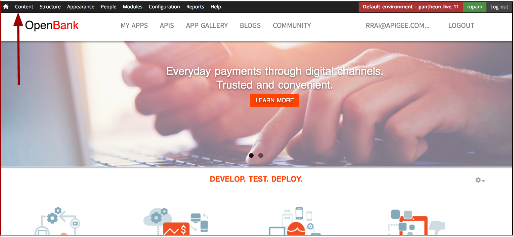
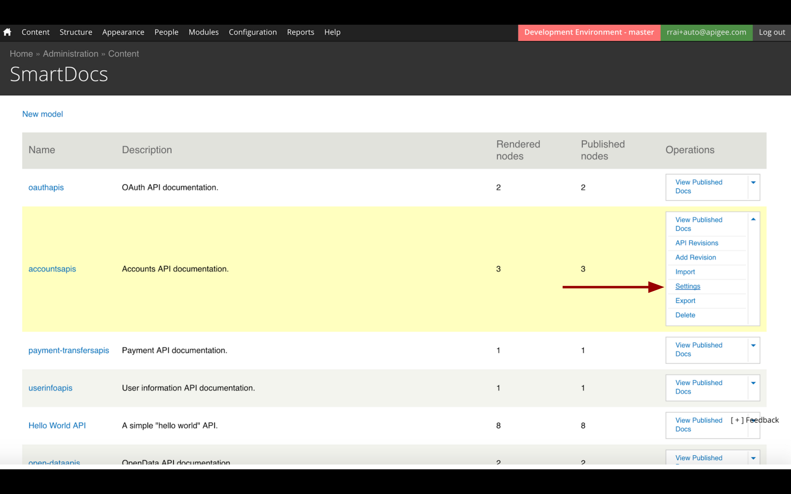
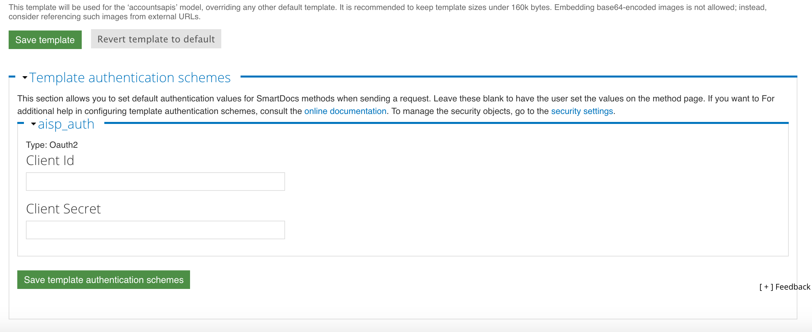

Since you have landed here, we assume you already have or requested for [Apigee developer portal](https://goo.gl/j8Vbew).

## **1. Introduction**

The intent of this document is to create a customized openbank developer portal from default Apigee developer Portal. 

To know more about Apigee developer portal, refer http://apigee.com/docs/developer-services/content/what-developer-portal.

On successful deployment of customized developer portal, you will be able to access following:

 - Apigee Edge Developer Portal with a customized theme for OpenBank.
 - Openbank API Documentation for easy understanding.
 - OpenBank Sandbox for trying out openbank APIs
 - App Gallery to promote App ecosystem of your API program.
 
Your portal after the openbank customization will look like [openbank.apigee.com](https://openbank.apigee.com) 

## **2. Pre-Requisites**

 1. You have an Apigee OpenBank APIs deployed on your Apigee org(If not, [click here](https://github.com/apigee/openbank/blob/master/README.md)).
 2. Apigee dev-portal admin access.
 3. Access to your site’s repo.
	 - If you have dev portal setup on cloud, you must have pantheon access for the portal. If you don't have it already, you will need to connect with Apigee team to request to associate your pantheon account([Sign Up](https://pantheon.io/)) with Apigee developer portal. [Working with panthoen](http://docs.apigee.com/developer-services/content/working-pantheon).
	 - If you have dev portal setup on-premise, you already have access to your site repo at /var/html/www


## **3. Getting Started**

### **3.1 Get OpenBank portal custom code**

 - Clone [this](https://github.com/apigee/openbank) openbank git repo.
 - /openbank/src/developerportal contains the custom openbank portal code.

### **3.2 Customize default Apigee developer portal**


#### **3.2.1 Get default developer portal code**
##### **on-cloud**
clone the default portal code. You will find relevant instructions on how to clone, in the pantheon UI or [click here](https://pantheon.io/docs/git/).

##### **on-premise**
You will find the default developer code at /var/www/html/sites on the portal instance.


#### **3.2.2 Backup of default developer portal**
A backup of default portal’s code is recommended before importing custom changes.

##### **on-cloud**
Login Pantheon -> goto your portal site -> Backups -> and create a new backup.

##### **on-premise** 
Take backup of /var/www/html/sites directory.

#### **3.2.3 Update the Open APIs**
In order to update the swagger files (**src/devportal/all/modules/custom/openbank_swagger**) with the parameters such as host, client ID, client secret, you need to execute the **/openbank/init_portal.js** script.
 
#### Pre-requisites
 - APIGEE edge org should have 'PISP_App' and 'AISP_App' apps(the deploy script would have created it by default).
 
#### How to execute ?
```bash
 $ cd openbank
 $ npm install
 $ node init_portal.js
```
 - Provide the APIGEE edge org, env, username password etc when prompted while executing the script.

#### **3.2.4 Replace default code**

 - Replace the sites/all folder of default portal repo with the git repo  openbank/src/devportal/all.
 
 
```bash
 $ cp -r openbank/src/devportal/all <path to pantheon cloned repo>/sites
```

#### **3.2.5 Save the changes**
##### **on-cloud**
you will need to push the changes back to the pantheon git repo.
```
git add <path to pantheon cloned repo>/sites/all
git commit -m "replacing all folder"
git push origin master
```
Please provide pantheon username and password if prompted. Alternatively you can update the pantheon profile with your SSH key.
##### **on-premise** 
The changes are already there in /var/html/www, which will automatically reflect on the portal.

## **4. Further Configurations**
Please log in to the portal with the admin credentials.
Once you have logged in with admin credentials, you will find the **admin menu** for making portal customizations.


### **4.1 Apply HBR template for the smartdocs**

 - Go to admin menu Configuration -> SmartDocs -> Advanced settings.
 - Click on Choose File button to select the .hbr file from cloned/downloaded openbank source code i.e. */openbank/src/developerportal/smartdocs-openbank.hbr*

### **4.2 Enable the dbank responsive theme**
This theme contains all openbank related customisation for the portal, and hence needs to be enabled and set as default.

 - Goto **{your_portal_site}/admin/appearance**.
 - Choose **dbank responsive theme**, enable it and set it as default.

### **4.3 Import the image archive**
All the required images are zipped in openbank repo here - openbank/src/devportal/opebank.zip and need to be imported on the portal.

 - Goto **{your_portal_site}/file/add/upload/archive**
 - Upload the zip **openbank/src/devportal/opebank.zip**
 - Click submit.

All the required files will be automatically available, and can be found in admin -> content -> Files

### **4.4 Smartdocs import and rendering**
Smartdocs methods provide a template for configuring and making API calls through the portal. Hence each API needs a smartdoc method associated with it. In order to create smartdocs for the APIS, one needs to import respective Open API json files which will get converted to smartdocs method internally. In order to do so, follow the steps below:

**4.4.1 Enable the openbank swagger modules**

To enable openbank swagger or any other module, go to admin -> modules and enable them.

 - Select **openbank_swagger** module from the list of modules, enable it.
 - Select **smartdocs_auth** module from the list, enable it.
 - Save the configuration.
 
 
    
**4.4.2 Create models and import all openbank API’s swagger files**
Import of all openbank API’s swagger files need to be done for creation of the respective smartdocs. In order to do so, 
 - Goto address bar > enter **{your_portal_site}/swagger/import**
 - Creation of models and import of swagger will start and the progress can be seen on UI.
    
**4.4.3 Render and publish all API’s methods**
 - Goto address bar > enter **{your_portal_site}/swagger/publish**
 - Rendering and publishing of models will start and the progress of the same will be seen on UI.
 - You’ll find list of all OpenBank APIs models, rendered and published in admin menu -> Content -> SmartDocs.

**4.4.4 Configure OAuth 2.0 authentication**
This section is applicable to accounts and userinfo openbank resources only i.e. should not be applied to OAuth and Basepath API documentation. OAuth 2.0 authentication can be used to secure the access to the API. Following steps need to be done to accomplish this.

**4.4.4.1 Update Security Scheme**

 - Select Content > SmartDocs.
 - For **accountapis** and **userinfoapis** API models, select **settings** from Operations drop-down.
  
 - Select "**security settings**" hyperlink from the Template authentication schemes section.
  
 
 - Select Edit for **aisp_auth** security scheme.
 - Select **Authorisation code** for Grant type.


 - In Advanced Settings section set Authorization Request Method to **Header**.
 
 
 - Select Submit.

**4.4.4.2 Configure Template Authentication Scheme**

 - Select Content > SmartDocs.
 - For the **accountsapis** API models, select **Settings** from Operations drop-down.
 - In Template authentication schemes, set **Client Id & Client Secret** to the Client Id & Client Secret of '*AISP_App*' app, which was created during deployment. (https://enterprise.apigee.com/platform/{org}/apps)
 
 - Click the "Save template authentication schemes" button.
 - For the **userinfoapis** API models, select **Settings** from Operations drop-down.
 - In Template authentication schemes, set **Client Id & Client Secret** to the Client Id & Client Secret of '*AISP_App*' app, which was created during deployment.
 - Ensure that the callback URL fetched on Saving the Template Auth for *accountsapis* and *userinfoapis* models is already present in the '*AISP_App's*' list of comma seperated values for callback URL. If not, do the same.
 

### **4.5 Enable other required modules**

 - Goto **{your_portal_site}/admin/modules**
 - Enable **home_page_blocks**
 - Click Save Configuration
 - Enable **all_component_features**
 - Save the configuration
 - Enable **openbank_install** module
 - Save the configuration
 - Goto admin-> configuration -> Development -> performance.
 - Click "clear all caches"

### **4.6 Assign blocks to context**
 - Goto admin menu -> structure -> context.
 - Select Edit for "**custom_home**".
 - Select "**Blocks**" from the Reactions section.
 
 
 - Select block drop down, and select **Home Page blocks, API CATALOGUE desc and Reference Apps**.
 
 - Select **+Add** tab for contet section and select "**show row weights**".
 
 
 - Assign row weights to the blocks.
  
  
 - Click on save.

#### "**The portal setup is complete**"

Visit the portal. 

Go through the documentation, create your own Apps and explore the APIS.   
**Note**:

 - In order to Get started, click on **getting-started** on the main page.
 - For exploring and trying the APIs click on the **APIs** on the main menu, select from the list of APIs available, and get started.


## **5. Create your own developer App**
one can go and create own developer app and register it. In order to accomplish this:

 - Goto MY ACCOUNT -> My Apps.
 - Click on Add a new App and specify the following values.
 - Specify any Name.
 - Select a product type from the list of products depending on the requirement of the app.


 
  
## **6. Further Portal Customisation**
### **6.1 Change Dev Portal Logo and Shortcut icon**
one can go and change the default logo for the portal by following the steps below:

 -  Goto admin menu Appearance -> settings -> dbank Responsive theme.
 - Goto *Logo image settings* section.
 - Uncheck default Logo opetion.
 - Upload new logo for the portal.
 - Uncheck *Shortcut icon settings*.
 - Upload new Shortcut icon for the portal.
 - Save the changes.
 
### **6.2 Change Portal site name**

 - Goto admin menu Configuration -> System -> Site Information.
 - Goto site details section and make required changes.
 - Save the changes.
 
### **6.3 Create New smartDocs methods**

 
 - In order to create new smartdocs for the portal, one can go to admin menu -> content -> smartdocs, create new model, import respective open api files and render.

### **6.4 Managing user accounts**

 -  To manage user registration, goto admin menu -> configuration -> people -> account settings, and make respective changes.
