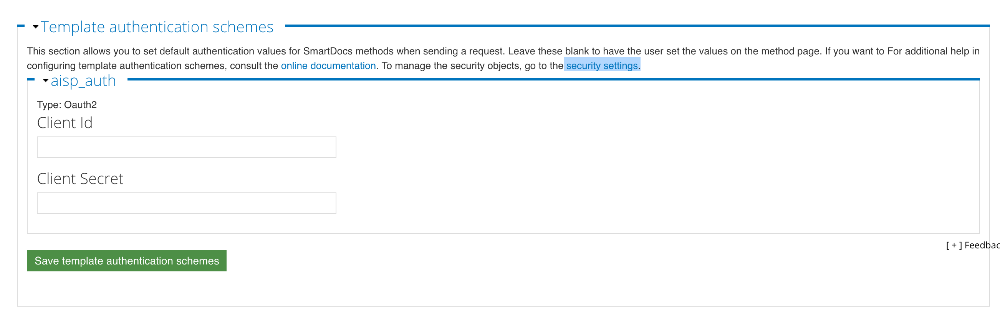
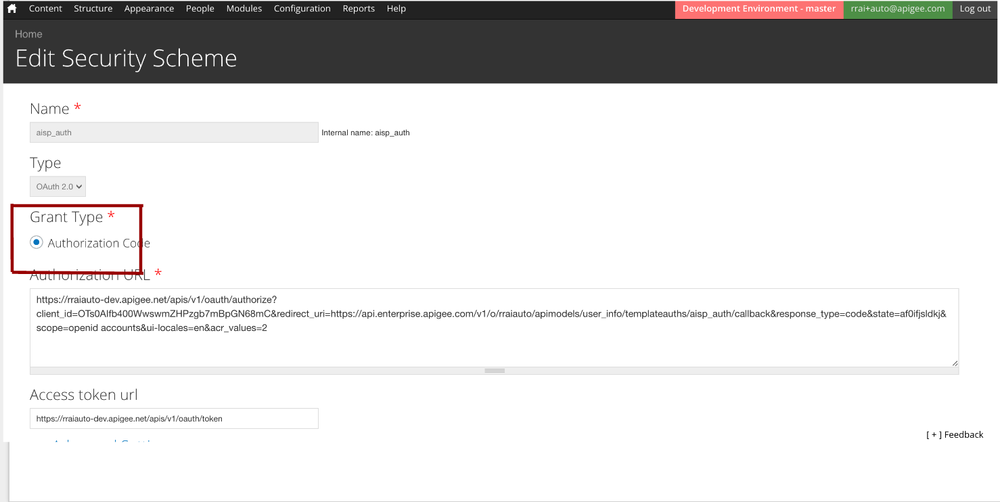
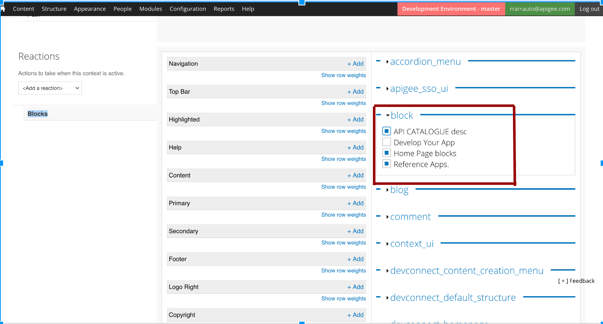
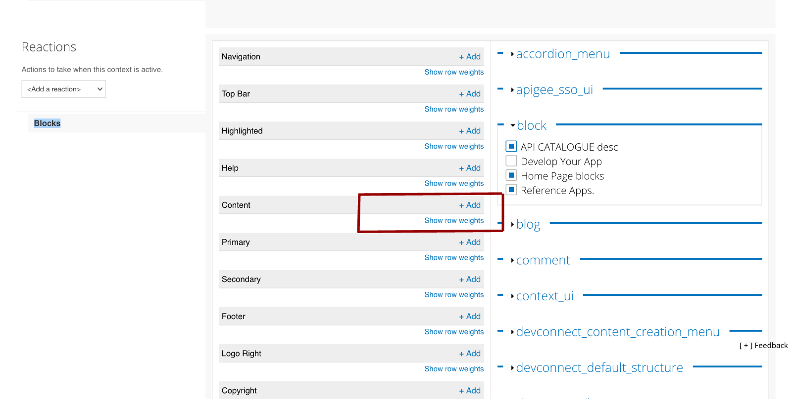

**1. Introduction**

----------
The intent of this document is to guide step by step how to deploy and configure openbank custom features on a default (out of the box) Apigee developer Portal. To know more about Apigee developer portal, refer http://apigee.com/docs/developer-services/content/what-developer-portal.

On successful deployment of customized site, you will be able to access following:

 - Apigee Edge Developer Portal with a customized theme for OpenBank.
 - Openbank API Documentation for easy understanding.
 - OpenBank Sandbox for trying out openbank APIs
 - App Gallery to promote App ecosystem of your API program.
 - The deployment of custom changes would result into a similar site as Apigee openbank.

**2. Pre-Requisites**

----------
You have created an Apigee developer portal either in the cloud or on-prem. On-prem instance is assumed to be created on a Linux server.
You have an Apigee Edge gateway exposing OpenBank APIs.
If you have In-Cloud Instance:

 - Apigee dev-portal admin access.
 - Pantheon access to your site’s Git repo.
 - Refer http://docs.apigee.com/developer-services/content/working-pantheon.
 - You will need to connect with Apigee support team to request them to associate your Apigee dev portal with your created pantheon account.

**3. Getting Started**

----------
**3.1 Get code with customized changes**

 - Clone the openbank git repo.
 - Go to /openbank/src/developerportal – This contains custom portal source code.

**3.2 Customize default developer portal**

**3.2.1 Get default developer portal source**

The default portal code to be modified is in sites folder.

**In-Cloud instance:**
Get the default site’s code from git via pantheon service.
Note: Here, you can get clone of site’s code by using “git clone ” command followed by pantheon service credentials.
The code will be downloaded on your local system.

**On-prem instance:**
You will find the default developer code at /var/www/html/sites.


**3.2.2 Backup of default developer portal**

A backup of default portal’s code is recommended before importing custom changes.

**For In-Cloud instance,**
Login Pantheon -> goto your portal site -> Backups -> and create a new backup.

**For On-prem instance,**
Take a backup of /var/www/html/sites directory.

**3.2.3 Replace all folder of default code with all folder from openbank repo.**

The all folder from default portal code now has to be replaced with the all folder from the openbank source code. Replace(Overwrite) /sites/all directory with git **/openbnk/src/developerportal/all** directory.

**Note**: We further need to do few **manual configurations**.
Access the developer portal website and **login** with admin credentials.


**3.2.4 update the Open APIs**

The **/devportal/all/modules/custom/openbank_swagger** directory contains the OPEN API json files for the Openbank APIs.

 - In order to update the parameters such as host, client ID, client secret, we need to execute the **/openbank/init_portal.js** script.
 - Give the client Id and client secret of your apps either from APIGEE edge default aisp and pisp apps created, or the one created by yourself.
 - One can create an app by logging in and  **{your_portal_site}/user/me/apps**.
 - create the App, and provide its credentials.
execute the following command to update the swagger files:

```bash
 $ node init_portal.js
```
Enter the required parameters for updating the swagger files. eg: Client Id of the registered app, client secret of the registered app etc.

**3.2.5 push the changes back to the portal git repository**
**Note**: you will need to push the custom changes back to git, for In-Cloud instance only. 

**4. Further Configurations**

----------
**4.1 Enable the dbank responsive theme**

This theme contains all openbank related customisation for the portal, and hence needs to be enabled and set as default.

 - Goto {your_portal_site}**/admin/appearance**.
 - Choose **dbank responsive theme**, enable it and set it as default.

**4.2 Import the image archive**

All the required images are present in openbank.zip. In order to make the images appear on the portal, we need to import the images. Follow the steps below:

 - Goto **{your_portal_site}/file/add/upload/archive**.
 - Upload the git repo **openbank/src/devportal/opebank.zip**.
 - Click submit.
All the required files will be automatically available, and can be found in admin -> content -> Files

**4.3 Smartdocs import and rendering**

Smartdocs methods provide a template for configuring and making API calls through the portal. Hence each API needs a samrtdoc method associated with it. In order to create smartdocs for the APIS, one needs to import respective Open API json files which will get converted to smartdocs method internally. In order to do so, we need to follow the steps below:

**4.3.1 Enable the openbank swagger module**

To enable openbank swagger or any other module, we can go to admin -> modules and enable them

 - Select **openbank_swagger** module from the list of modules, enable it, and save the configuration.
    
**4.3.2 Create models and import all openbank API’s swagger files**

Import of all openbank API’s swagger files need to be done for creation of the respective smartdocs. In order to do so, 

 - Goto address bar > enter **{your_portal_site}/swagger/import**.
 - Creation of models and import of swagger will start and the progress of the same will be seen on UI.
    
**4.3.3 Render and publish all API’s methods**

 - Goto address bar > enter **{your_portal_site}/swagger/publish**.
 - Rendering and publishing of models will start and the progress of the same will be seen on UI.
 - You’ll find list of all openbank APIs models, rendered and published.

**4.3.4 Configure OAuth 2.0 authentication**

This section is applicable to accounts and userinfo openbank resources only i.e. should not be applied to OAuth and Basepath API documentation. OAuth 2.0 authentication can be used to secure the access to the API. Following steps need to be done to accomplish this.

**4.3.4.1 Update Security Scheme**

 - Select Content > SmartDocs.
 - For the API model which needs to be configured(**accountapis** and **userinfoapis**), select **settings** from Operations drop-down.
 - Select "**security settings**" hyperlink from the Template authentication schemes section.
  
 
 - Select Edit for **aisp_auth** security scheme.
 - Select **Authorisation code** for Grant type.


 - In Advanced Settings section set Authorization Request Method to **Header**.
 
 
 - Select Submit.

**4.3.4.2 Configure Template Authentication Scheme**

 - Select Content > SmartDocs.
 - For the same model, select **Settings** from Operations drop-down.
 - In Template authentication schemes, set **Client Id & Client Secret** to the previously created App’s Consumer key and Secret respectively.**Use an App which request for Account Access APIs.**
 - Click the "Save template authentication schemes" button.

**4.4 Enable other required modules**

 - Goto **{your_portal_site}/admin/modules**.
 - Enable **home_page_blocks**.
 - Click Save Configuration.
 - Enable **all_component_features** module and **openbank_install** module.
 - Click save.
 - Goto admin-> configuration -> Development -> performance.
 - Click "clear all caches"

**4.5 Assign blocks to context**

 - Goto admin menu -> structure -> context.
 - Select Edit for "**custom_home**".
 - Select "**Blocks**" from the Reactions section.
 
 
 - Select block drop down, and select **Home Page blocks, API CATALOGUE desc and Reference Apps**.
 
 - Select **+Add** tab for contet section and select "**show row weights**".
 
 
 - Assign row weights to the blocks.
  
  
 - Click on save.
   
**4.5 Create your own developer App**
one can go and create own developer app and register it. In order to accomplish this:

 - Goto MY ACCOUNT -> My Apps.
 - Click on Add a new App and specify the following values.
 - Specify any Name.
 - Select a product type from the list of products depending on the requirement of the app.

**The portal setup is complete**. Now, we can visit the portal, go through the documentation, create Apps and explore the APIS.

**Note**:

 - In order to Get started, click on **getting-started** on the main page.
 - For exploring and trying the APIs click on the **APIs** on the main menu, select from the list of APIs available, and get started.
 - In order to create new smartdocs for the portal, one can go to admin -> content -> smartdocs, create new model, import respective open api files and render.
 - To manage user registration, goto admin menu -> configuration -> people -> account settings and make respective changes.
