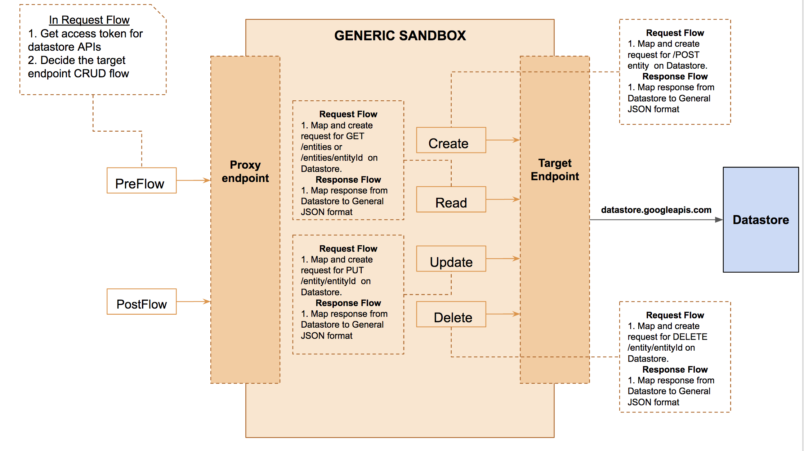

The datastore-connector proxy is an interface build for RESTful CRUD operations on Google cloud datastore.



The RESTful Operations which can be performed on Google cloud datatsore are:
* POST /kind : It crates new entity(s) for the kind. Can create single entity, or multiple entities in an array at once.

  Samples:
  ````
    Request: 
    POST datastore-connector/person
    {
        "name": "Peter",
        "dob" : "26-06-1994"
    }

    Response:
    {
        "uuid" : "81b07d48-c437-42cb-90fa-cbdc9d187ce2", "name": "Peter",
        "dob" : "26-06-1994"
    }
    ````
  
    ````
    Request: POST datastore-connector/person

    [
      {
          "uuid" : "81b07d48-c437-42cb-90fa-cbdc9d187ce2"
          "name": "Peter",
          "dob" : "26-06-1994"
      },
      {
          "uuid" : "7yb07h48-c437-42cb-90fa-cgkc9d187ce2"
          "name": "Jessica",
          "dob" : "29-08-1994"
      }
    ]
    Response:
    [
      {
          "name": "Peter",
          "dob" : "26-06-1994"
      },
      {
          "name": "Jessica",
          "dob" : "29-08-1994"
      }
    ]
    ````
  


* GET /kind : Gets all entities of the kind matching query. One can query based on attributes, limit the number of results, perform pagination, and order the results. Pass all attribute queries as a single query parameter "ql". eg: ql = Where name = 'Peter'

	Samples:
    ````
    Request: 
    GET datastore-connector/person?ql=where name = 'Peter'

    Response:
    { 
      "entities"
      [
        {
            "uuid" : "81b07d48-c437-42cb-90fa-cbdc9d187ce2", 
            "name": "Peter",
            "dob" : "26-06-1994"
        }
      ]
    }
    ````
    ````
    Request: 
    GET datastore-connector/person?limit=2&ql= Where name = 'Peter'&order=name&cursor=12345jhjgfd

    Response:
    { 
      "entities"
      [
        {
            "uuid" : "81b07d48-c437-42cb-90fa-cbdc9d187ce2", 
            "name": "Peter",
            "dob" : "26-06-1994"
        }
      ]
    }
    ````
* GET /kind/entitityId : Get a single entity based on unique Id. The unique Id could be uuid, or name( if present)

	Samples:
    ````
    Request: 
    GET datastore-connector/person/Peter

    Response:
    { 
      "entities"
      [
        {
            "uuid" : "81b07d48-c437-42cb-90fa-cbdc9d187ce2", 
            "name": "Peter",
            "dob" : "26-06-1994"
        }
      ]
    }
    ````
    ````
    Request: 
    GET datastore-connector/person/81b07d48-c437-42cb-90fa-cbdc9d187ce2

    Response:
    { 
      "entities"
      [
        {
            "uuid" : "81b07d48-c437-42cb-90fa-cbdc9d187ce2", 
            "name": "Peter",
            "dob" : "26-06-1995"
        }
      ]
    }
    ````
* PUT /kind/entityId. Updates a single entity based on unique Id. The unique Id could be uuid or name( if present ).

	Samples:
  ````
    Request: 
    PUT datastore-connector/person/Peter
    {
        "dob" : "26-06-1995"
    }

    Response:
    {
        "uuid" : "81b07d48-c437-42cb-90fa-cbdc9d187ce2", 
        "name": "Peter",
        "dob" : "26-06-1994"
    }
    ````
* DELETE /Kind/entityId : Deletes a single entity based on unique Id. The unique Id should be uuid